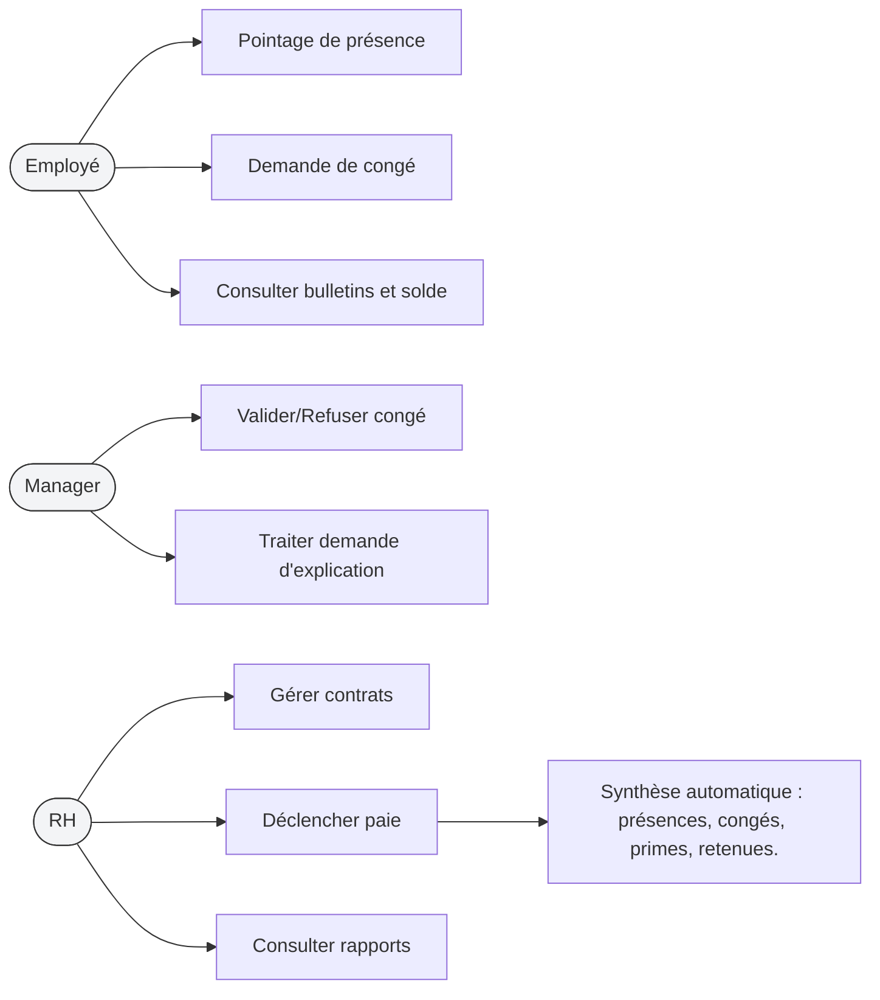

## 3.1 Logique des Cas d'Utilisation (Use Case Narrative)

Acteurs principaux

- Employé : pointe sa présence, soumet des demandes de congés, consulte son historique.
- Manager : valide/conteste demandes, traite explications, consulte l'assiduité de son équipe.
- RH : gère contrats, déclenche la paie, consulte rapports globaux.

Récits principaux

- Pointage de présence : L'employé effectue un "check-in"; le système calcule le statut et enregistre.
- Demande de congé : L'employé soumet -> Manager avis -> RH validation finale (optionnel).
- Traitement disciplinaire : Retard/absence génère une demande d'explication ; manager répond ; action appliquée.

### Diagramme Use Case (Mermaid)

Chaque cas d'utilisation doit être accompagné d'un scénario happy-path et d'au moins un scénario alternatif (ex : manager absent -> escalade vers RH).
