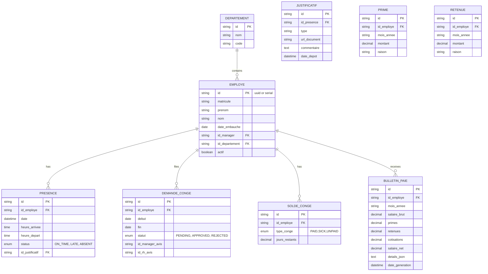

## 3.2 Architecture de la Base de Données (Schéma Relationnel)

Description rapide

La base est organisée en quatre pôles : Core (Employe, Departement), Temps (Presence, Justificatif), Social (SoldeConge, DemandeConge) et Financier (BulletinPaie, Retenue, Prime).

### Diagramme ER (Mermaid)

Remarques

- `BulletinPaie.details_json` contient la photo complète du calcul (déductions par absence, minutes de retard, etc.).
- Les clefs primaires peuvent être des UUIDs ou des séquences selon le SGBD.
