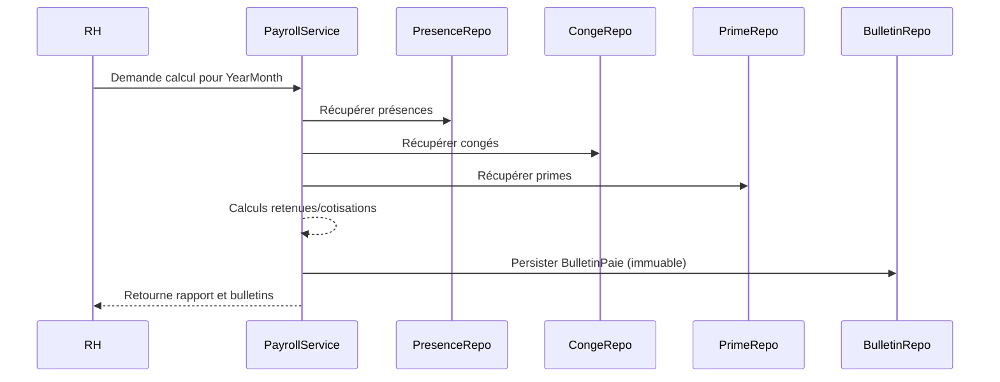

## 7. Spécifications du Moteur de Paie

Objectif

Fournir un moteur reproductible et auditable qui transforme les données brutes (présences, congés, primes) en bulletins de paie immuables.

Contrat d'entrée

- Employe (profil contractuel, salaireBase, statut temps plein/partiel)
- YearMonth (mois de calcul)
- List<Presence> (toutes les présences du mois)
- List<DemandeConge> (congés pour le mois)
- List<Prime> et List<Retenue>

Étapes du calcul

1. Calcul du salaire brut = salaireBase + primes
2. Calcul des retenues liées aux présences
   - Retard : total_minutes_non_justifiees * tarif_minute (paramétrable)
   - Absence : jours_absence_non_payes * (salaireBase / jours_ouvrables)
3. Calcul des cotisations : appliquer les pourcentages configurés (ex : 22% total)
4. Salaire net = brut - retenues - cotisations
5. Génération du `BulletinPaie` avec champ immuable `details_json` détaillant le calcul.

### Diagramme de séquence (Mermaid)

Paramètres configurables

- tarif_minute_retard
- pourcentage_cotisations
- jours_ouvrables_par_mois

Exemple de JSON `details_json`

{
  "salaireBase": 3000.00,
  "primes": 200.00,
  "minutesRetard": 45,
  "retenueRetard": 30.00,
  "joursAbsence": 1,
  "retenueAbsence": 100.00,
  "cotisations": 700.00,
  "salaireNet": 2370.00
}
