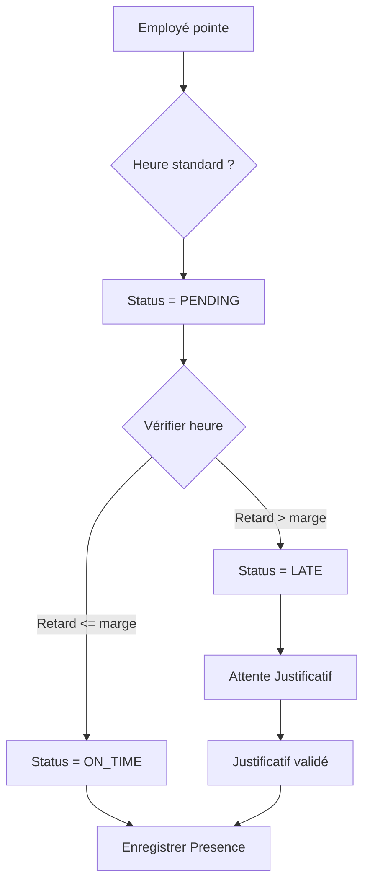
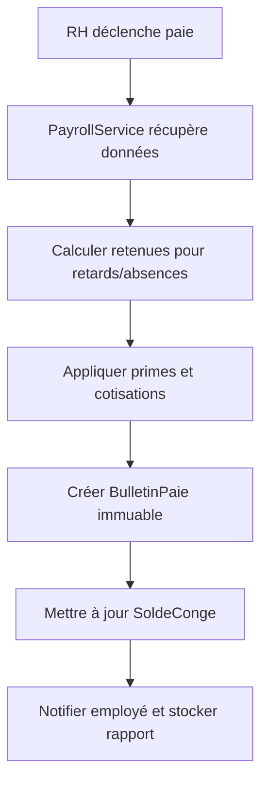
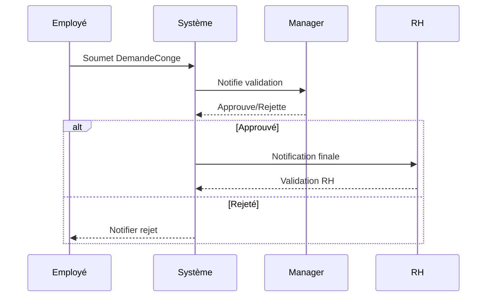

## 9. Synthèse des flux métiers principaux

### Flux Arrivée (Activity)

```mermaid
flowchart TD
  A[Employé pointe] --> B{Heure standard ?}
  B --> C[Status = PENDING]
  C --> D{Vérifier heure}
  D -->|Retard > marge| F[Status = LATE]
  D -->|Retard <= marge| E[Status = ON_TIME]
  F --> G[Attente Justificatif]
  G --> H[Justificatif validé]
  E --> I[Enregistrer Presence]
  H --> I
```

### Flux Fin de Mois (Activity)

```mermaid
flowchart TD
  R[RH déclenche paie] --> P[PayrollService récupère données]
  P --> Q[Calculer retenues pour retards/absences]
  Q --> S[Appliquer primes et cotisations]
  S --> T[Créer BulletinPaie immuable]
  T --> U[Mettre à jour SoldeConge]
  U --> V[Notifier employé et stocker rapport]
```

### Flux Congé (Sequence)

```mermaid
sequenceDiagram
    participant Emp as Employé
    participant Sys as Système
    participant Man as Manager
    participant RH as RH

    Emp->>Sys: Soumet DemandeConge
    Sys->>Man: Notifie validation
    Man-->>Sys: Approuve/Rejette
    alt Approuvé
      Sys->>RH: Notification finale
      RH-->>Sys: Validation RH
    else Rejeté
      Sys-->>Emp: Notifier rejet
    end
```
